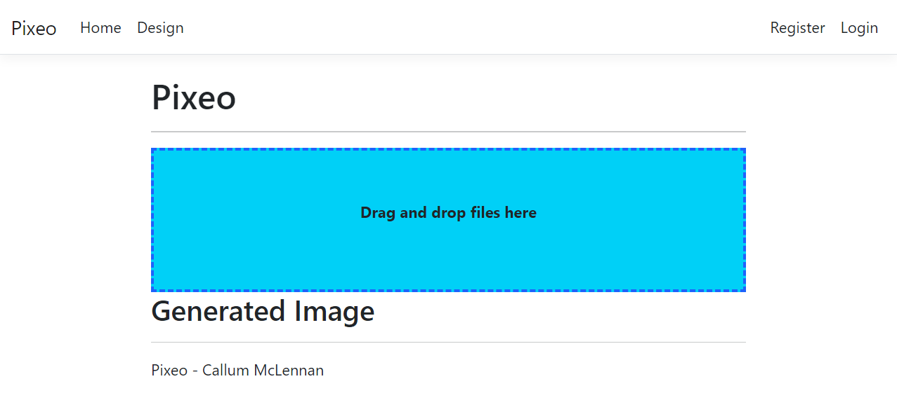

# Image-Uploader (Pixeo)
Brief Project Description here. Included reasoning behind design/technologies in Design page.

## Prerequisites
Ensure you have met the following requirements:
* You have installed [.NET 6.0](https://dotnet.microsoft.com/en-us/download/dotnet/6.0) and [Visual Studio 2022](https://visualstudio.microsoft.com/downloads/)

## Installation
To install Image-Uploader (Pixeo), follow these steps:
...

## Usage
<!-- Provide demo URL here -->
<!-- Provide instructions for running the project locally -->

## Contact

## License
This project uses the following license: MIT License.

 -->